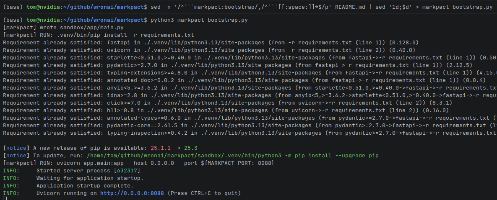

# markpact

Markpact to minimalny runtime, który pozwala trzymać cały projekt w jednym `README.md`.
Runtime ignoruje zwykły Markdown, a wykonuje wyłącznie codeblocki `markpact:*`.

## 1️⃣ Cel projektu

- **Jedno README jako źródło prawdy**
- **Możliwość uruchomienia projektu bez ręcznego tworzenia struktury plików**
- **Automatyzacja**
  Bootstrap tworzy pliki w sandboxie, instaluje zależności i uruchamia komendę startową.

## 2️⃣ Kontrakt README (codeblocki `markpact:*`)

- **`markpact:bootstrap <lang>`**
  Dokładnie jeden bootstrap na README. Odpowiada za parsowanie codeblocków i uruchomienie.
- **`markpact:deps <scope>`**
  Lista zależności dla danego scope (np. `python`).
- **`markpact:file <lang> path=...`**
  Zapisuje plik do sandboxu pod ścieżką `path=...`.
- **`markpact:run <lang>`**
  Jedna komenda uruchomieniowa wykonywana w sandboxie.

---
```markpact:bootstrap python
#!/usr/bin/env python3
"""MARKPACT v0.1 – Executable Markdown Runtime"""
import os, re, subprocess, sys
from pathlib import Path

README = Path(sys.argv[1] if len(sys.argv) > 1 else "README.md")
SANDBOX = Path(os.environ.get("MARKPACT_SANDBOX", "./sandbox"))
SANDBOX.mkdir(parents=True, exist_ok=True)
RE = re.compile(r"^```markpact:(?P<kind>\w+)(?:\s+(?P<meta>[^\n]+))?\n(?P<body>.*?)\n^```[ \t]*$", re.DOTALL | re.MULTILINE)

def run(cmd):
    print(f"[markpact] RUN: {cmd}")
    env = os.environ.copy()
    venv = SANDBOX / ".venv" / "bin"
    if venv.exists():
        env.update(VIRTUAL_ENV=str(venv.parent), PATH=f"{venv}:{env.get('PATH','')}")
    subprocess.check_call(cmd, shell=True, cwd=SANDBOX, env=env)

def main():
    deps, run_cmd = [], None
    for m in RE.finditer(README.read_text()):
        kind, meta, body = m.group("kind"), (m.group("meta") or "").strip(), m.group("body").strip()
        if kind == "file":
            p = re.search(r"\bpath=(\S+)", meta)
            if not p: raise ValueError(f"markpact:file requires path=..., got {meta!r}")
            f = SANDBOX / p[1]
            f.parent.mkdir(parents=True, exist_ok=True)
            f.write_text(body)
            print(f"[markpact] wrote {f}")
        elif kind == "deps" and meta == "python":
            deps.extend(line.strip() for line in body.splitlines() if line.strip())
        elif kind == "run":
            run_cmd = body
    if deps:
        venv_pip = SANDBOX / ".venv" / "bin" / "pip"
        if os.environ.get("MARKPACT_NO_VENV") != "1" and not venv_pip.exists():
            run(f"{sys.executable} -m venv .venv")
        (SANDBOX / "requirements.txt").write_text("\n".join(deps))
        run(f"{'.venv/bin/pip' if venv_pip.exists() else 'pip'} install -r requirements.txt")
    if run_cmd:
        run(run_cmd)
    else:
        print("[markpact] No run command defined")

if __name__ == "__main__":
    main()
```

## 3️⃣ Instalacja

### Opcja A: Pakiet pip (zalecane)

```bash
pip install markpact
```

Użycie:

```bash
markpact README.md                    # uruchom projekt
markpact README.md --dry-run          # podgląd bez wykonywania
markpact README.md -s ./my-sandbox    # własny katalog sandbox
```

### Opcja B: Instalacja lokalna (dev)

```bash
git clone https://github.com/wronai/markpact.git
cd markpact
make install   # lub: pip install -e .
```

### Opcja C: Ekstrakcja bootstrapu (zero dependencies)

- **Ekstrakcja bootstrapu do pliku**

  Ten wariant jest odporny na przypadek, gdy w samym bootstrapie występują znaki ``` (np. w regexie):

  ```bash
  sed -n '/^```markpact:bootstrap/,/^```[[:space:]]*$/p' README.md | sed '1d;$d' > markpact.py
  ```

- **Uruchomienie**

  ```bash
  python3 markpact.py
  ```

- **Konfiguracja (env vars)**

  ```bash
  MARKPACT_PORT=8001 MARKPACT_SANDBOX=./.markpact-sandbox python3 markpact.py
  ```

## 4️⃣ Sandbox i środowisko

- **`MARKPACT_SANDBOX`**
  Zmienia katalog sandboxu (domyślnie `./sandbox`).
- **`MARKPACT_NO_VENV=1`**
  Wyłącza tworzenie `.venv` w sandboxie (przydatne, jeśli CI/Conda zarządza środowiskiem).
- **Port zajęty (`[Errno 98] address already in use`)**
  Ustaw `MARKPACT_PORT` na inny port lub zatrzymaj proces, który używa `8000`.

## 5️⃣ Dependency management

- **Python**
  Bootstrap zbiera `markpact:deps python`, zapisuje `requirements.txt` w sandboxie i instaluje zależności.

## 6️⃣ Uruchamianie i workflow

- **Wejście**
  `python3 markpact.py [README.md]`
- **Kolejność**
  Bootstrap parsuje wszystkie codeblocki, zapisuje pliki i dopiero na końcu uruchamia `markpact:run`.

## 6.1 Konwencje i format metadanych

- **Nagłówek codeblocka**
  ` ```markpact:<kind> <lang> <meta>`

  Minimalnie wymagane jest `markpact:<kind>`.
  `lang` jest opcjonalny i pełni rolę informacyjną (bootstrap może go ignorować).

- **Metadane**
  Dla `markpact:file` wymagane jest `path=...`.
  Metadane mogą zawierać dodatkowe tokeny (np. w przyszłości `mode=...`, `chmod=...`).

## 6.2 CI/CD

- **Rekomendacja**
  Uruchamiaj bootstrap w czystym środowisku (np. job CI) i ustaw sandbox na katalog roboczy joba.

- **Przykład (shell)**

  ```bash
  export MARKPACT_SANDBOX=./.markpact-sandbox
  export MARKPACT_PORT=8001
  python3 markpact.py README.md
  ```

- **Wskazówki**
  - **Deterministyczność**
    Pinuj wersje w `markpact:deps` (np. `fastapi==...`).
  - **Bezpieczeństwo**
    Traktuj `markpact:run` jak skrypt uruchomieniowy repo: w CI odpalaj tylko zaufane README.
  - **Cache**
    Jeśli CI wspiera cache, cache’uj katalog `MARKPACT_SANDBOX/.venv`.

## 6.3 Współpraca z LLM

- **Zasada**
  LLM może generować/edytować projekt poprzez modyfikacje README (codeblocki `markpact:file`, `markpact:deps`, `markpact:run`).
- **Oczekiwania**
  - `markpact:file` zawsze zawiera pełną zawartość pliku.
  - Każda zmiana zależności idzie przez `markpact:deps`.
  - Jedna komenda startowa w `markpact:run`.

## 7️⃣ Najlepsze praktyki

- **Bootstrap jako pierwszy fenced codeblock w README**
- **Każdy plik w osobnym `markpact:file`**
- **Zależności tylko w `markpact:deps`**
- **Jedna komenda startowa w `markpact:run`**
- **Ekstrakcja bootstrapu**
  Nie używaj zakresu `/,/```/` (bo ``` może wystąpić w treści, np. w regexie). Używaj `^```$` na końcu.

## 8️⃣ Działający przykład (FastAPI)

## 1️⃣ Dependencies

```markpact:deps python
fastapi
uvicorn
```

---

## 2️⃣ Application Files

```markpact:file python path=app/main.py
from fastapi import FastAPI

app = FastAPI()

@app.get("/")
def root():
    return {"message": "Hello from Executable Markdown"}
```

---

## 3️⃣ Run Command

```markpact:run python
uvicorn app.main:app --host 0.0.0.0 --port ${MARKPACT_PORT:-8088}
```