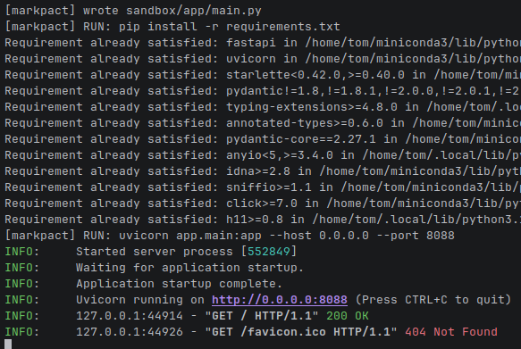
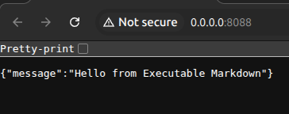

# markpact

Markpact to minimalny runtime, który pozwala trzymać cały projekt w jednym `README.md`.
Runtime ignoruje zwykły Markdown, a wykonuje wyłącznie codeblocki `markpact:*`.


## Run shell


```bash
sed -n '/^```markpact:bootstrap/,/^```$/p' README.md | sed '1d;$d' > markpact_bootstrap.py
python3 markpact_bootstrap.py
```

## Service online



 ---
 
```markpact:bootstrap python
#!/usr/bin/env python3
"""
MARKPACT v0.1 – Executable Markdown Runtime
"""

import os
import re
import subprocess
import sys
from pathlib import Path

README = Path(sys.argv[1] if len(sys.argv) > 1 else "README.md")
SANDBOX = Path(os.environ.get("MARKPACT_SANDBOX", "./sandbox"))
SANDBOX.mkdir(parents=True, exist_ok=True)

CODEBLOCK_RE = re.compile(
    r"^```markpact:(?P<kind>\w+)(?:\s+(?P<meta>[^\n]+))?\n(?P<body>.*?)\n^```[ \t]*$",
    re.DOTALL | re.MULTILINE,
)

def parse_blocks(text):
    return CODEBLOCK_RE.finditer(text)

def write_file(path, content):
    full = SANDBOX / path
    full.parent.mkdir(parents=True, exist_ok=True)
    full.write_text(content)
    print(f"[markpact] wrote {full}")

def run(cmd):
    print(f"[markpact] RUN: {cmd}")
    env = os.environ.copy()
    venv_bin = SANDBOX / ".venv" / "bin"
    if venv_bin.exists():
        env["VIRTUAL_ENV"] = str(SANDBOX / ".venv")
        env["PATH"] = f"{venv_bin}:{env.get('PATH', '')}"
    subprocess.check_call(cmd, shell=True, cwd=SANDBOX, env=env)

def ensure_venv():
    if os.environ.get("MARKPACT_NO_VENV") == "1":
        return
    python = SANDBOX / ".venv" / "bin" / "python"
    if python.exists():
        return
    run(f"{sys.executable} -m venv .venv")

def parse_path(meta):
    m = re.search(r"\bpath=([^\s]+)", meta)
    if not m:
        raise ValueError(f"markpact:file requires path=..., got meta={meta!r}")
    return m.group(1)

def main():
    text = README.read_text()
    blocks = list(parse_blocks(text))

    deps = {"python": [], "node": [], "system": []}
    run_cmd = None

    for block in blocks:
        kind = block.group("kind")
        meta = (block.group("meta") or "").strip()
        body = block.group("body").strip()

        if kind == "file":
            path = parse_path(meta)
            write_file(path, body)
        elif kind == "deps":
            deps.setdefault(meta, [])
            deps[meta].extend(line.strip() for line in body.splitlines() if line.strip())
        elif kind == "run":
            run_cmd = body

    if deps.get("python"):
        ensure_venv()
        req_file = SANDBOX / "requirements.txt"
        req_file.write_text("\n".join(deps["python"]))
        if (SANDBOX / ".venv" / "bin" / "pip").exists():
            run(".venv/bin/pip install -r requirements.txt")
        else:
            run("pip install -r requirements.txt")

    if run_cmd:
        run(run_cmd)
    else:
        print("[markpact] No run command defined")

if __name__ == "__main__":
    main()
```

## Kontrakt README (codeblocki `markpact:*`)

- **`markpact:bootstrap <lang>`**
  Jedyny bootstrap w projekcie. Odpowiada za parsowanie codeblocków i uruchomienie.
- **`markpact:deps <scope>`**
  Lista zależności dla danego scope, np. `python`.
- **`markpact:file <lang> path=...`**
  Zapisuje plik do sandboxu pod `path=...`.
- **`markpact:run <lang>`**
  Jedna komenda uruchomieniowa wykonywana w sandboxie.

## Quickstart

- **Ekstrakcja bootstrapu (odporna na ``` w regexie)**

  ```bash
sed -n '/^```markpact:bootstrap/,/^```[[:space:]]*$/p' README.md | sed '1d;$d' > markpact_bootstrap.py
```

- **Uruchomienie**

  ```bash
python3 markpact_bootstrap.py
```

- **Zmiana portu (gdy `8000` jest zajęty)**

  ```bash
MARKPACT_PORT=8001 python3 markpact_bootstrap.py
```

- **Zmiana katalogu sandboxu**

  ```bash
MARKPACT_SANDBOX=./.markpact-sandbox python3 markpact_bootstrap.py
```

## 1️⃣ Dependencies

```markpact:deps python
fastapi
uvicorn
```

---

## 2️⃣ Application Files

```markpact:file python path=app/main.py
from fastapi import FastAPI

app = FastAPI()

@app.get("/")
def root():
    return {"message": "Hello from Executable Markdown"}
```

---

## 3️⃣ Run Command

```markpact:run python
uvicorn app.main:app --host 0.0.0.0 --port ${MARKPACT_PORT:-8000}