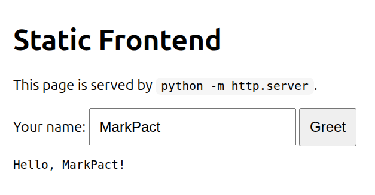

# Static Frontend (HTML) Example



Minimalny statyczny frontend (HTML/CSS/JS) uruchamiany przez Markpact.

## Uruchomienie

```bash
markpact examples/static-frontend/README.md
```

---

```html markpact:file path=public/index.html
<!doctype html>
<html lang="en">
  <head>
    <meta charset="utf-8" />
    <meta name="viewport" content="width=device-width, initial-scale=1" />
    <title>Markpact Static Frontend</title>
    <style>
      body { font-family: system-ui, sans-serif; margin: 40px; }
      .card { max-width: 720px; padding: 20px; border: 1px solid #ddd; border-radius: 12px; }
      input, button { padding: 10px; font-size: 16px; }
      code { background: #f6f6f6; padding: 2px 6px; border-radius: 6px; }
    </style>
  </head>
  <body>
    <div class="card">
      <h1>Static Frontend</h1>
      <p>This page is served by <code>python -m http.server</code>.</p>

      <label>
        Your name:
        <input id="name" placeholder="World" />
      </label>
      <button id="btn">Greet</button>

      <pre id="out"></pre>
    </div>

    <script>
      const $name = document.getElementById('name');
      const $out = document.getElementById('out');
      document.getElementById('btn').addEventListener('click', () => {
        const name = ($name.value || 'World').trim();
        $out.textContent = `Hello, ${name}!`;
      });
    </script>
  </body>
</html>
```

```bash markpact:run
python3 -m http.server ${MARKPACT_PORT:-8088} --directory public
```

```text markpact:test http
# Health check is not available for static server; just validate root
GET / EXPECT 200
```
